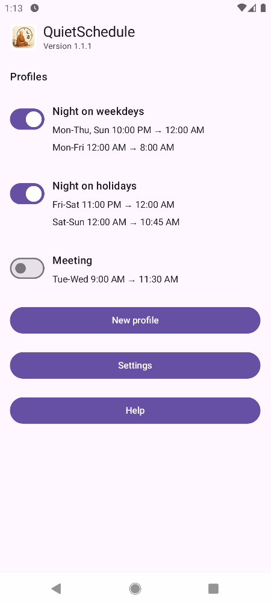
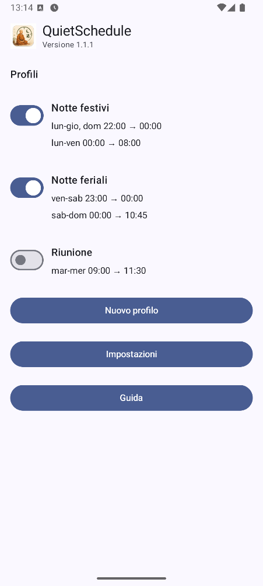

# QuietSchedule

**Automatic Do Not Disturb scheduling for Android.**

QuietSchedule is a free and open-source Android application that automatically enables and disables Android **Do Not Disturb (DND)** according to configurable weekly schedules.

It is intentionally focused on one task: making DND scheduling simple, predictable and transparent.

<p align="center">
  
  
</p>

<p align="center">
  <em>English interface</em>&nbsp;&nbsp;&nbsp;&nbsp;&nbsp;&nbsp;&nbsp;&nbsp;&nbsp;&nbsp;
  <em>Italian interface</em>
</p>

## Features

* Multiple DND profiles
* Multiple weekly schedules for each profile
* Configurable days of the week
* Configurable start and end times
* Enable or disable individual profiles
* Conflict detection between enabled profiles
* Android Priority interruption rules
* Calls priority rules
* Messages priority rules
* Conversations priority rules
* Alarm, reminder, event, media and system-sound exceptions
* Repeat caller support
* Configurable notification visual effects
* Automatic schedule reconstruction after device reboot
* Recalculation after date or time changes
* Recalculation after time-zone changes
* Daylight-saving-time handling
* Optional status notification
* English and Italian localization
* Android system 12/24-hour time format
* Android system light/dark theme

## Privacy

QuietSchedule is designed to operate entirely on the device.

It does **not** use:

* advertising;
* tracking;
* analytics;
* telemetry;
* user accounts;
* proprietary cloud services;
* Internet access;
* location access;
* contacts access;
* file or storage access.

Application configuration is stored locally on the device.

## Requirements

* **Android 11 or later**
* Minimum API level: **Android API 30**
* Android **Do Not Disturb / Notification Policy access**

On Android versions where notification permission is required, it may also be requested if the optional QuietSchedule status notification is enabled.

## How it works

A QuietSchedule profile contains:

* a name;
* one or more weekly time ranges;
* DND Priority exception settings.

Example:

```text
Work

Monday - Friday
09:00 -> 17:00
```

When the configured interval starts, QuietSchedule applies Android Priority Do Not Disturb mode using the policy configured for that profile.

When the interval ends, QuietSchedule recalculates the required DND state.

Multiple profiles can be enabled at the same time as long as their schedules do not overlap.

## DND Priority exceptions

Each profile can configure which Android Priority interruptions are allowed while DND is active.

Supported categories include:

* alarms;
* reminders;
* events;
* media;
* system sounds;
* repeat callers;
* calls;
* messages;
* conversations.

For calls and messages, Android sender scopes such as contacts and starred contacts can be selected without QuietSchedule reading the contacts database directly.

QuietSchedule relies on Android's standard Notification Policy APIs.

## Schedule limitations

QuietSchedule currently supports **same-day schedules only**.

Valid examples:

```text
08:00 -> 17:00
06:00 -> 08:00
18:00 -> 22:00
```

Overnight schedules are not supported.

For example:

```text
22:00 -> 07:00
```

is invalid.

The end time must always be later than the start time on the same day.

## Scheduling precision

QuietSchedule does not require Android Exact Alarms.

This avoids requesting additional special access, but it also means Android may occasionally delay a scheduled DND change because of:

* Doze;
* battery optimization;
* device power-management policies.

When QuietSchedule executes a scheduled event, it recalculates the desired state from the current time and stored configuration rather than blindly applying an outdated event.

## Device reboot and time changes

QuietSchedule reconstructs its scheduling state after relevant Android system events, including:

* device reboot;
* manual date or time changes;
* time-zone changes;
* daylight-saving-time transitions.

Weekly schedules always use the current local time of the device.

## Download

Pre-built APK versions are available from the repository's **Releases** page:

https://github.com/elettrone2012/quiet-schedule/releases

You can also build QuietSchedule directly from source.

F-Droid distribution may be added in the future.

## Installation

### From a GitHub Release

1. Open the repository's **Releases** page.
2. Download the APK from the latest release.
3. Install the APK on an Android 11 or later device.
4. Open QuietSchedule.
5. Grant Android Do Not Disturb / Notification Policy access when requested.
6. Configure and enable your profiles.

Android may ask for confirmation before installing an APK downloaded outside an application store.

## Building from source

### Requirements

* Android Studio
* Android SDK
* JDK version compatible with the project's Android Gradle configuration

### Build

Clone the repository:

```bash
git clone https://github.com/elettrone2012/quiet-schedule.git
```

Open the project in Android Studio and allow Gradle synchronization to complete.

Then build or run the `app` module on:

* an Android 11+ emulator; or
* an Android 11+ physical device.

DND integration is best tested on a physical Android device.

## Technology

QuietSchedule is a native Android application built with:

* **Kotlin**
* **Jetpack Compose**
* **Android DataStore**
* **Android Notification Policy APIs**

The application does not depend on an external backend or cloud service.

## Permissions

QuietSchedule follows a minimal-permission approach.

It requires access only where necessary for its functionality.

In particular, QuietSchedule does **not** request:

* Internet permission;
* contacts permission;
* location permission;
* calendar permission;
* storage/files permission;
* Wi-Fi or Bluetooth access.

Android DND sender scopes such as *Contacts* and *Starred contacts* are handled by Android itself. QuietSchedule does not need to read the user's contacts.

## Project philosophy

QuietSchedule is intentionally not a generic Android automation application.

Its goals are:

* simplicity;
* predictable behavior;
* readable source code;
* minimal permissions;
* privacy;
* no external service dependency;
* no advertising;
* no tracking;
* open-source development.

Features unrelated to DND scheduling are intentionally outside the scope of the project.

## Project status

QuietSchedule is an independent open-source project.

It is provided without commercial support or guaranteed maintenance.

The project is currently developed primarily for personal use and open-source experimentation.

Issues, technical feedback, pull requests and forks are welcome.

## Bug reports

If you encounter a problem, open a GitHub Issue and include, where possible:

* QuietSchedule version;
* Android version;
* device manufacturer and model;
* description of the configured schedule;
* expected behavior;
* actual behavior;
* steps required to reproduce the problem.

Please avoid including personal or sensitive information in issue reports.

## Contributing

Contributions are welcome.

You can:

* report bugs;
* propose improvements;
* submit pull requests;
* review the source code;
* fork the repository;
* experiment with alternative implementations.

The current functional behavior is documented in:

[`SPECIFICATION.md`](SPECIFICATION.md)

Changes should preferably preserve the project's main principles of simplicity, minimal permissions and predictable DND scheduling.

## Forks

Forks and derivative projects are welcome.

QuietSchedule is released under the MIT License, which permits reuse, modification and redistribution subject to the terms of the license.

If you build something useful from QuietSchedule, linking back to the original project is appreciated.

## AI-assisted development

QuietSchedule was developed with AI-assisted programming using **OpenAI ChatGPT, GPT-5.6 Sol**, together with manual design, implementation, testing and review.

AI assistance was used during development in **August 2026**.

## License

QuietSchedule is released under the **MIT License**.

See [`LICENSE`](LICENSE) for the full license text.

Copyright © 2026 QuietSchedule contributors.
